<h1 align="center">
  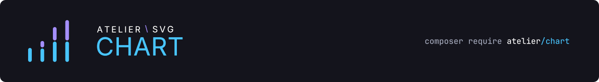
</h1>

<p align="center">Accessible SVG charts for PHP, with typed models, layout, and themes.</p>

<p align="center">
  
  
  
  
  
  <a href="LICENSE"></a>
</p>

Compare categories, show change, or display proportions with fourteen chart families.
Builders turn your values into immutable models; the renderer produces SVG with accessible
titles and data descriptions.

```php
use Atelier\Chart\Chart;

echo Chart::render(Chart::bar()
    ->series('Revenue', ['Q1' => 18, 'Q2' => 27, 'Q3' => 24, 'Q4' => 35])
    ->build());
```

Examples from the catalogue: grouped bars and line charts.

<p align="center">
  
  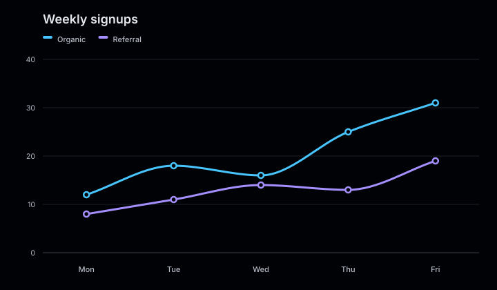
</p>

Atelier Layout calculates the plot geometry and Atelier SVG supplies the output document.
Rendering runs in PHP without JavaScript, a browser, or an external binary. Each SVG contains
one chart; its viewBox lets it scale to the space available.

**[Catalogue](#catalogue) · [Themes](#themes) · [SVG output](#svg-output) ·
[Errors](#error-handling) · [Gallery](#gallery) · [Documentation](#documentation)**

## Installation

```bash
composer require atelier/chart
```

Requires PHP 8.3+ and the `atelier/layout` and `atelier/svg` packages.
Composer installs the package dependencies.

## Quick start

```php
<?php

declare(strict_types=1);

use Atelier\Chart\Chart;

require __DIR__.'/vendor/autoload.php';

$model = Chart::bar()
    ->title('Quarterly revenue')
    ->description('Revenue by quarter for 2025 and 2026, in millions.')
    ->series('2025', ['Q1' => 18, 'Q2' => 32, 'Q3' => 24, 'Q4' => 42])
    ->series('2026', ['Q1' => 26, 'Q2' => 24, 'Q3' => 38, 'Q4' => 35])
    ->build();

echo Chart::render($model);
```

`build()` validates the data and returns an immutable model. `Chart::render()` returns its SVG
markup. The following snippets reuse this model, its imports, and the autoloader.
See [Getting started](docs/getting-started.md) for saving the result and choosing a chart family.

## Catalogue

<table>
  <tr>
    <td align="center" width="33%">
      <a href="docs/charts/bar.md"><br>Bar charts</a>
    </td>
    <td align="center" width="33%">
      <a href="docs/charts/stacked-bar.md">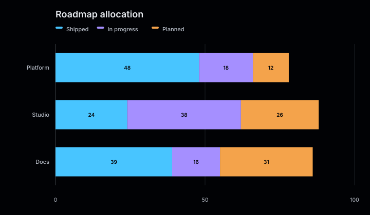<br>Stacked bar charts</a>
    </td>
    <td align="center" width="33%">
      <a href="docs/charts/diverging-bar.md">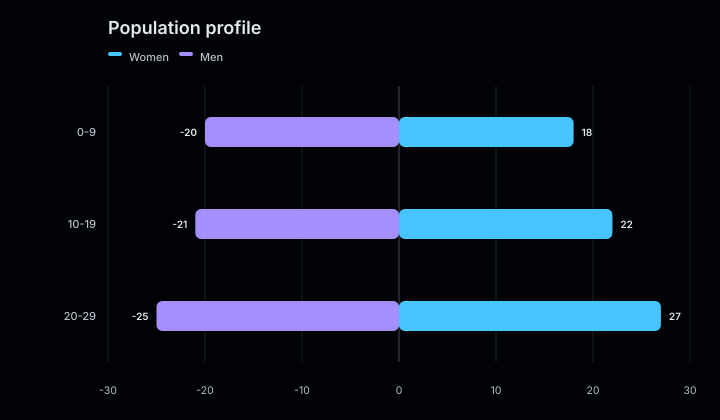<br>Diverging bar charts</a>
    </td>
  </tr>
  <tr>
    <td align="center" width="33%">
      <a href="docs/charts/line.md"><br>Line charts</a>
    </td>
    <td align="center" width="33%">
      <a href="docs/charts/area.md">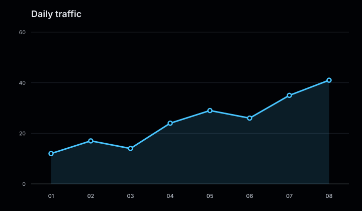<br>Area charts</a>
    </td>
    <td align="center" width="33%">
      <a href="docs/charts/radar.md">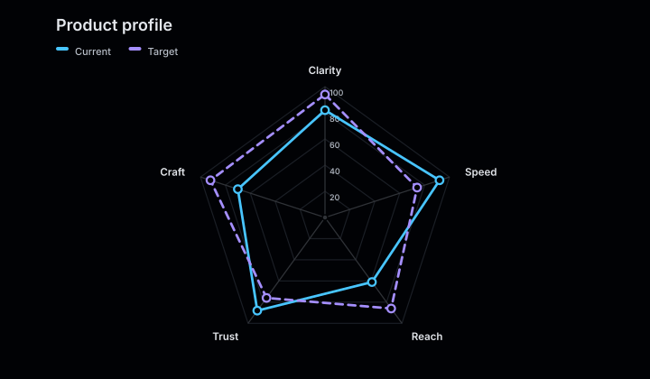<br>Radar charts</a>
    </td>
  </tr>
  <tr>
    <td align="center" width="33%">
      <a href="docs/charts/pie.md"><br>Pie charts</a>
    </td>
    <td align="center" width="33%">
      <a href="docs/charts/donut.md">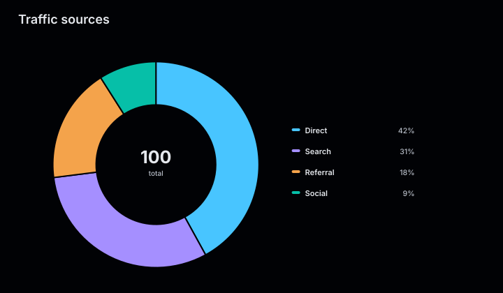<br>Donut charts</a>
    </td>
    <td align="center" width="33%">
      <a href="docs/charts/scatter.md"><br>Scatter plots</a>
    </td>
  </tr>
  <tr>
    <td align="center" width="33%">
      <a href="docs/charts/bubble.md">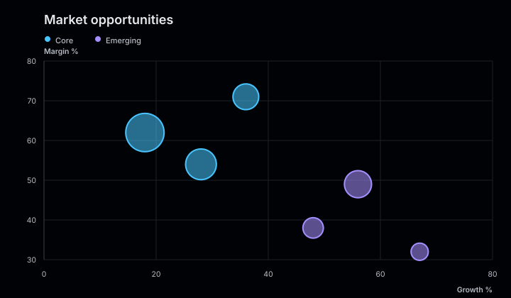<br>Bubble charts</a>
    </td>
    <td align="center" width="33%">
      <a href="docs/charts/gauge.md">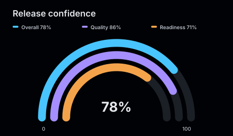<br>Gauges</a>
    </td>
    <td align="center" width="33%">
      <a href="docs/charts/sparkline.md">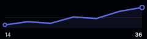<br>Sparklines</a>
    </td>
  </tr>
  <tr>
    <td align="center" width="33%">
      <a href="docs/charts/activity.md"><br>Activity charts</a>
    </td>
    <td align="center" width="33%">
      <a href="docs/charts/strip.md">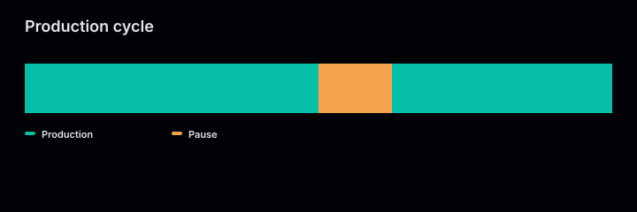<br>Strip charts</a>
    </td>
  </tr>
</table>

## Themes

Pass a theme when rendering, without rebuilding the model:

```php
use Atelier\Chart\Theme\Theme;

echo Chart::render($model, Theme::warm());
```

The presets are `default`, `alto`, `dark`, `mono`, and `warm`. A theme owns the palette,
background, text, axes, and grid colours. Derive one with `with()` or supply a custom theme;
see [Themes](docs/themes/overview.md).

## SVG output

`Chart::renderDocument($model)` returns an Atelier SVG document for further composition.
The default output includes accessibility information; CSS classes and data attributes are
optional:

```php
use Atelier\Chart\Renderer\Svg\SvgRenderOptions;

echo Chart::render($model, options: new SvgRenderOptions(
    classes: true,
    dataAttributes: true,
));
```

Enable these options when a stylesheet or script needs to address chart elements.
They also apply to `Chart::renderDocument()` and `SvgRenderer`.

## Error handling

Invalid or incompatible input throws `Atelier\Chart\Exception\InvalidArgumentException`.
All package exceptions implement `Atelier\Chart\Exception\ExceptionInterface`.
Required series counts, category order, and accepted value ranges depend on the chart family.

See [Handle invalid input](docs/getting-started.md#handle-invalid-input) for a complete example
and [numeric precision](docs/getting-started.md#format-displayed-values) when working with large
integers or very small values.

## Gallery

From a repository checkout with dependencies installed:

```bash
php examples/generate.php
```

Writes `examples/output/index.html` with examples of the chart families and themes.

## Documentation

- [Getting started](docs/getting-started.md): build, render, and save a first chart.
- [Chart types](docs/charts/): choose a family and explore illustrated variants.
- [Series](docs/series/overview.md): organize categories, points, and composition data.
- [Layout](docs/layout/overview.md): control chart dimensions, axes, labels, and legends.
- [Scales](docs/layout/scales.md): understand default domains and set consistent scales across charts.
- [Labels](docs/layout/labels.md): format displayed values.
- [Themes](docs/themes/overview.md): use a preset or define the visual roles.

Read the complete guides and generated illustrations in [docs/](docs/).

## Contributing

Contributions are welcome. Visit the [project on GitHub](https://github.com/ateliersvg/chart)
to [report a bug](https://github.com/ateliersvg/chart/issues/new),
[suggest a feature](https://github.com/ateliersvg/chart/issues/new), or
[open a pull request](https://github.com/ateliersvg/chart/pulls).

Before submitting code, run:

```bash
composer qa
composer coverage
```

Changes to public behaviour need tests and a documentation update.
Keep line coverage at 95% or higher. Coverage reporting requires PCOV or Xdebug.

## Support

Bug reports, security disclosures, and contribution guidelines are collected at
[ateliersvg.com/support](https://ateliersvg.com/support/).

## License

Atelier Chart is released under the [MIT License](LICENSE).
