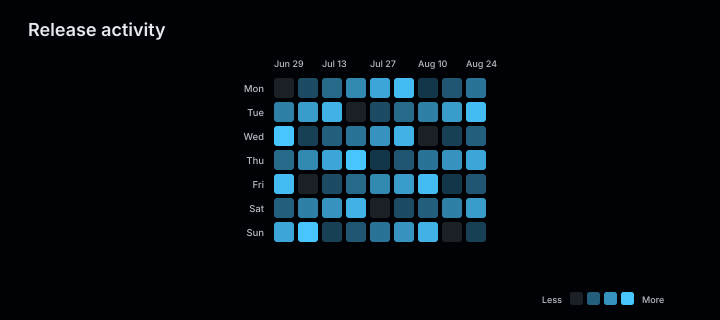
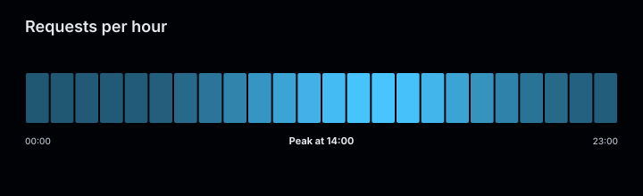
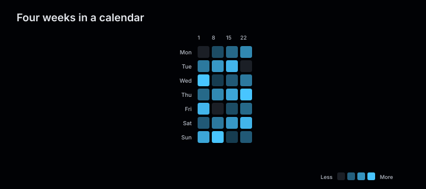
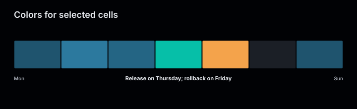
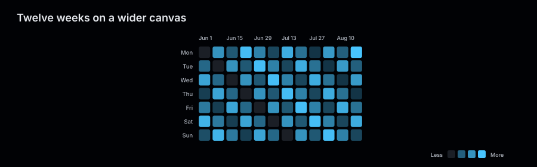

# Activity charts

An activity chart draws one cell per period and encodes its value as opacity. The cells
wrap into a seven row grid, or sit on a single row.

<figure class="product-output product-output--chart">

<figcaption>Each cell is one period; opacity encodes activity from less to more.</figcaption>
</figure>

## Example

```php
<?php

declare(strict_types=1);

use Atelier\Chart\Chart;

require __DIR__.'/vendor/autoload.php';

$values = [];
$start = new DateTimeImmutable('2026-06-29');

for ($day = 0; $day < 63; ++$day) {
    $values[$start->modify('+'.$day.' days')->format('M j')] = 0 === $day % 11 ? 0 : (($day * 7 + intdiv($day, 4)) % 16) + 1;
}

$model = Chart::activity()
    ->title('Release activity')
    ->description('Daily releases across nine weeks.')
    ->series('Changes', $values)
    ->build();

echo Chart::render($model);
```

## One row

`strip()` lays every cell on one row instead of wrapping into a grid.

<figure class="product-output product-output--chart">

<figcaption>One cell per hour, opacity encoding volume, with a free-text summary underneath.</figcaption>
</figure>

```php
$values = [];

for ($hour = 0; $hour < 24; ++$hour) {
    $values[sprintf('%02d:00', $hour)] = (int) round(
        260.0 + 640.0 * exp(-(($hour - 14) ** 2) / 26.0) + 120.0 * exp(-(($hour - 9) ** 2) / 8.0),
    );
}

$model = Chart::activity()
    ->title('Requests per hour')
    ->description('Request volume across one day.')
    ->strip()
    ->summary('Peak at 14:00')
    ->size(720, 220)
    ->series('Requests', $values)
    ->build();

echo Chart::render($model);
```

## More examples

These snippets use the `Chart` import and Composer autoloader from the example above.

This chart takes one series. These examples vary its data and rendering options.

### Four weeks in a calendar

<figure class="product-output product-output--chart">

<figcaption>Twenty-eight daily values fill four columns of seven; zero days remain visible as empty cells.</figcaption>
</figure>

```php
$values = [];
$start = new DateTimeImmutable('2026-06-01');

for ($day = 0; $day < 28; ++$day) {
    $values[$start->modify('+'.$day.' days')->format('j')] = ($day * 5) % 11;
}

$model = Chart::activity()
    ->title('Four weeks in a calendar')
    ->description('Daily commits from Monday June 1 across four weeks.')
    ->calendar()
    ->series('Commits', $values)
    ->build();

echo Chart::render($model);
```

[Run this example](../../examples/variants/activity/four-weeks.php).

### Colors for selected cells

<figure class="product-output product-output--chart">

<figcaption>Two cells override the series color at full opacity, and summary() labels the strip.</figcaption>
</figure>

```php
$model = Chart::activity()
    ->title('Colors for selected cells')
    ->description('Two cells override the series color at full opacity, and summary() labels the strip.')
    ->strip()
    ->size(720, 220)
    ->summary('Release on Thursday; rollback on Friday')
    ->series('Deploys', [
        'Mon' => 2,
        'Tue' => 4,
        'Wed' => 3,
        'Thu' => ['value' => 8, 'color' => '#06bfa8', 'label' => 'Release'],
        'Fri' => ['value' => 1, 'color' => '#f4a34b', 'label' => 'Rollback'],
        'Sat' => 0,
        'Sun' => 2,
    ])
    ->build();

echo Chart::render($model);
```

[Run this example](../../examples/variants/activity/styled-strip.php).

### Twelve weeks on a wider canvas

<figure class="product-output product-output--chart">

<figcaption>Eighty-four daily values fill twelve calendar columns on a 900 by 280 canvas.</figcaption>
</figure>

```php
$values = [];
$start = new DateTimeImmutable('2026-06-01');

for ($day = 0; $day < 84; ++$day) {
    $values[$start->modify('+'.$day.' days')->format('M j')] = ($day * 7 + intdiv($day, 7)) % 19;
}

$model = Chart::activity()
    ->title('Twelve weeks on a wider canvas')
    ->description('Daily activity from Monday June 1 across twelve weeks.')
    ->size(900, 280)
    ->series('Changes', $values)
    ->build();

echo Chart::render($model);
```

[Run this example](../../examples/variants/activity/twelve-weeks.php).

## Configuration and behavior

| Setting | Default | Effect |
|---|---|---|
| `title(string)` | `Activity` | heading drawn at the top left |
| `description(string)` | none | text appended to `<desc>` alongside the data summary; never drawn |
| `series(string, array, ?string)` | required | the one series; array keys become cell categories, values become intensities, and the third argument colors every cell |
| `calendar()` | selected | wraps the cells into seven rows, filling one column of seven before starting the next |
| `strip()` | `calendar()` | lays every cell on a single row |
| `summary(string)` | none | free text centered under the row; drawn by `strip()` only |
| `size(float, float)` | 720 by 320 | canvas in user units; at least 240 by 180 |

A chart carries exactly one series. Values must be finite and non-negative, categories must
be unique, and input order is preserved: the model never sorts, parses a category as a date,
or fills a gap in a sequence.

Opacity is the value divided by the largest value in the series, mapped onto 0.22 to 1. A
zero value is drawn in the theme grid color instead. An individual cell may replace the color
and add a label:

```php
$model = Chart::activity()
    ->strip()
    ->series('Changes', [
        'Jul 2' => ['value' => 14, 'color' => '#48c5ff', 'label' => 'Release day'],
    ])
    ->build();
```

A cell that carries its own color is drawn fully opaque, so the value stops being visible and
only the color remains. That color is whatever the application passes; the model attaches no
meaning to it.

The calendar layout labels its seven rows `Mon` to `Sun` and every sixth column with a cell
category. Those row labels are fixed text: the model does not verify that the cells are daily
or that the first one falls on a Monday, so a series that does neither is mislabeled. The strip
layout labels the first and last category at the ends of the row, and draws the label of the
last cell at the top right.

With `SvgRenderOptions(dataAttributes: true)`, every cell carries `data-series`, `data-category`, `data-value`, and `data-label` when a label
was supplied.

## When to use

Use an activity chart when the reader needs the shape of a sequence: where the dense stretches
are, where the quiet ones are, how one period compares with its neighbours. Every cell takes
the same amount of space, so the chart is truthful when every period covers the same amount of
time, and misleading when they do not.

Use a [strip chart](strip.md) when relative weights should determine segment widths. A
[line chart](line.md) suits a series whose exact values matter more than its texture.

The SVG has `role="img"`, an `aria-label`, a `<title>`, and a `<desc>` containing the data summary.
