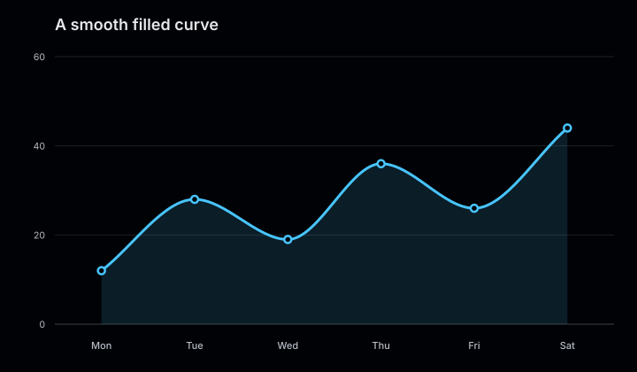
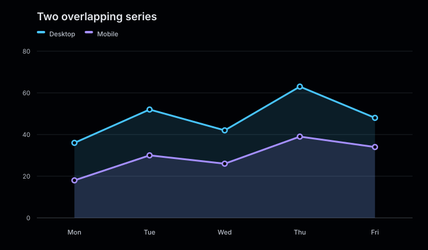
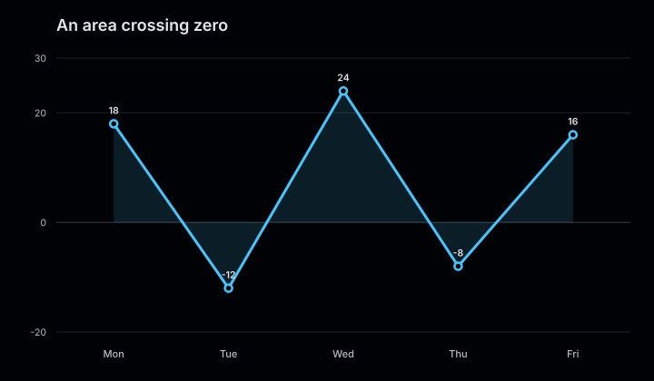

# Area charts

Area charts use the same ordered category model as line charts, then fill the space
between each line and the zero baseline.

<figure class="product-output product-output--chart">

<figcaption>An ordered traffic series rendered as a line with its magnitude filled to zero.</figcaption>
</figure>

## Example

```php
<?php

declare(strict_types=1);

use Atelier\Chart\Chart;

require __DIR__.'/vendor/autoload.php';

$model = Chart::area()
    ->title('Daily traffic')
    ->description('Visits over eight days.')
    ->series('Visits', [
        '01' => 12,
        '02' => 17,
        '03' => 14,
        '04' => 24,
        '05' => 29,
        '06' => 26,
        '07' => 35,
        '08' => 41,
    ])
    ->build();

echo Chart::render($model);
```

## More examples

These snippets use the `Chart` import and Composer autoloader from the example above.

### A smooth filled curve

<figure class="product-output product-output--chart">

<figcaption>smooth() rounds the upper edge while the fill returns to the zero baseline.</figcaption>
</figure>

```php
$model = Chart::area()
    ->title('A smooth filled curve')
    ->description('smooth() rounds the upper edge while the fill returns to the zero baseline.')
    ->smooth()
    ->series('Downloads', ['Mon' => 12, 'Tue' => 28, 'Wed' => 19, 'Thu' => 36, 'Fri' => 26, 'Sat' => 44])
    ->build();

echo Chart::render($model);
```

[Run this example](../../examples/variants/area/smooth.php).

### Two overlapping series

<figure class="product-output product-output--chart">

<figcaption>Two translucent areas share the same baseline; their values are not stacked.</figcaption>
</figure>

```php
$model = Chart::area()
    ->title('Two overlapping series')
    ->description('Two translucent areas share the same baseline; their values are not stacked.')
    ->series('Desktop', ['Mon' => 36, 'Tue' => 52, 'Wed' => 42, 'Thu' => 63, 'Fri' => 48])
    ->series('Mobile', ['Mon' => 18, 'Tue' => 30, 'Wed' => 26, 'Thu' => 39, 'Fri' => 34])
    ->build();

echo Chart::render($model);
```

[Run this example](../../examples/variants/area/two-series.php).

### An area crossing zero

<figure class="product-output product-output--chart">

<figcaption>A fixed -20 to 30 domain and value labels show the series crossing the zero baseline.</figcaption>
</figure>

```php
$model = Chart::area()
    ->title('An area crossing zero')
    ->description('A fixed -20 to 30 domain and value labels show the series crossing the zero baseline.')
    ->domain(-20, 30)
    ->showValues()
    ->series('Balance', ['Mon' => 18, 'Tue' => -12, 'Wed' => 24, 'Thu' => -8, 'Fri' => 16])
    ->build();

echo Chart::render($model);
```

[Run this example](../../examples/variants/area/signed-values.php).

## Configuration and behavior

- `series()` accepts category-to-value arrays. Additional series must use identical
  category labels in the same order.
- Each series renders its own translucent area and line. Areas are overlaid, not
  stacked.
- Positive and negative values are filled toward the zero baseline.
- `smooth()` enables monotone cubic curves; straight segments are the default.
- Value labels are hidden by default and can be enabled with `showValues()`.

## When to use

Use an area chart when the magnitude of an ordered series matters as much as its trend.
Prefer a line chart when comparing several series, because overlapping fills can make
individual values harder to read.

The SVG includes `role="img"`, a title, and a description with the data summary.
Enable `SvgRenderOptions(dataAttributes: true)` to add structured `data-*` attributes to each point.