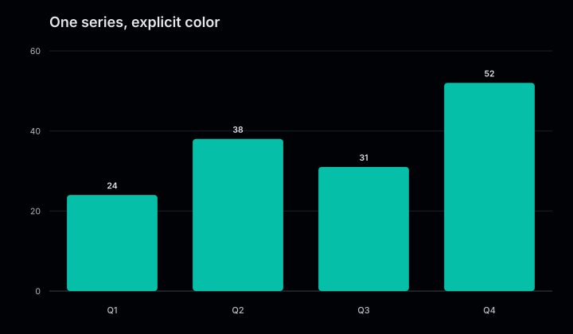
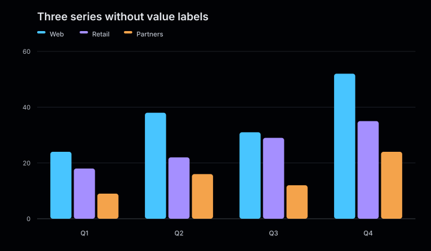
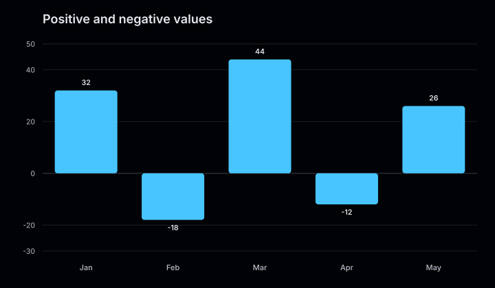

# Bar charts

Bar charts compare values across discrete categories. Add more than one series to
place grouped bars side by side within each category.

<figure class="product-output product-output--chart">

<figcaption>Two yearly series rendered as grouped bars across four quarters.</figcaption>
</figure>

## Example

```php
<?php

declare(strict_types=1);

use Atelier\Chart\Chart;

require __DIR__.'/vendor/autoload.php';

$model = Chart::bar()
    ->title('Quarterly revenue')
    ->description('Revenue by quarter for 2025 and 2026, in millions.')
    ->series('2025', ['Q1' => 18, 'Q2' => 32, 'Q3' => 24, 'Q4' => 42])
    ->series('2026', ['Q1' => 26, 'Q2' => 24, 'Q3' => 38, 'Q4' => 35])
    ->build();

echo Chart::render($model);
```

## More examples

These snippets use the `Chart` import and Composer autoloader from the example above.

### One series, explicit color

<figure class="product-output product-output--chart">

<figcaption>One teal bar per quarter, with each value printed above its bar.</figcaption>
</figure>

```php
$model = Chart::bar()
    ->title('One series, explicit color')
    ->description('One teal bar per quarter, with each value printed above its bar.')
    ->series('Revenue', ['Q1' => 24, 'Q2' => 38, 'Q3' => 31, 'Q4' => 52], '#06bfa8')
    ->build();

echo Chart::render($model);
```

[Run this example](../../examples/variants/bar/single-series.php).

### Three series without value labels

<figure class="product-output product-output--chart">

<figcaption>Three bars per quarter share a legend; showValues(false) removes the numeric labels.</figcaption>
</figure>

```php
$model = Chart::bar()
    ->title('Three series without value labels')
    ->description('Three bars per quarter share a legend; showValues(false) removes the numeric labels.')
    ->showValues(false)
    ->series('Web', ['Q1' => 24, 'Q2' => 38, 'Q3' => 31, 'Q4' => 52])
    ->series('Retail', ['Q1' => 18, 'Q2' => 22, 'Q3' => 29, 'Q4' => 35])
    ->series('Partners', ['Q1' => 9, 'Q2' => 16, 'Q3' => 12, 'Q4' => 24])
    ->build();

echo Chart::render($model);
```

[Run this example](../../examples/variants/bar/three-series.php).

### Positive and negative values

<figure class="product-output product-output--chart">

<figcaption>A fixed -30 to 50 domain puts gains above zero and losses below it.</figcaption>
</figure>

```php
$model = Chart::bar()
    ->title('Positive and negative values')
    ->description('A fixed -30 to 50 domain puts gains above zero and losses below it.')
    ->domain(-30, 50)
    ->series('Net change', ['Jan' => 32, 'Feb' => -18, 'Mar' => 44, 'Apr' => -12, 'May' => 26])
    ->build();

echo Chart::render($model);
```

[Run this example](../../examples/variants/bar/signed-domain.php).

## Configuration and behavior

- `series()` accepts a name, a non-empty category-to-value array, and an optional
  color as its third argument.
- Every series must use the same categories in the same order.
- Bars support positive and negative values around a zero baseline.
- Value labels are shown by default. Use `showValues(false)` to hide them.
- The default canvas is 720 by 420. Use `size($width, $height)` for another size;
  cartesian charts must be at least 240 by 180.

## When to use

Use a bar chart to compare a small number of series across named categories. Use a
stacked bar chart when the relationship between each part and its total matters more
than side-by-side comparison.

The SVG includes an accessible title and data summary. With `SvgRenderOptions(dataAttributes: true)`,
chart marks also carry `data-*` attributes. Each bar exposes its series, category, and value.