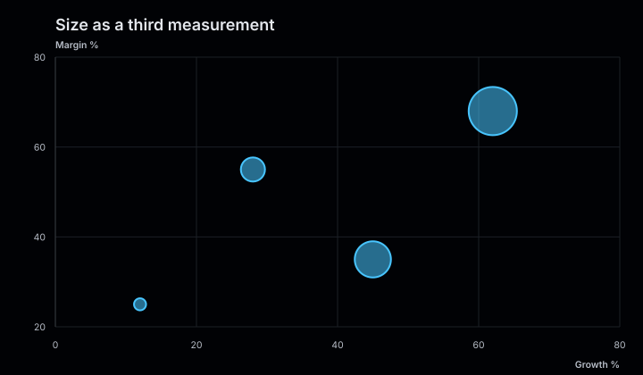
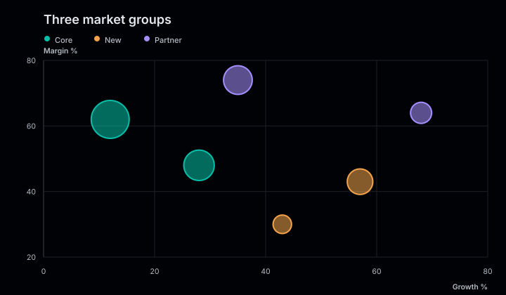
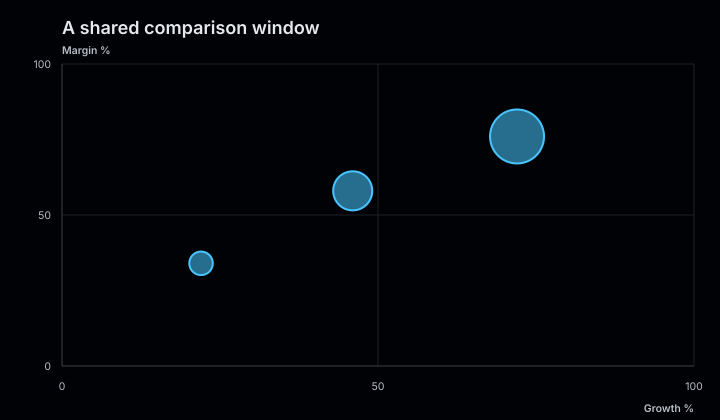

# Bubble charts

Bubble charts extend scatter plots with a third numeric variable. The `x` and `y`
values position each circle, while `size` determines its visible area.

<figure class="product-output product-output--chart">

<figcaption>Market growth and margin positioned on two axes, with revenue encoded by area.</figcaption>
</figure>

## Example

```php
<?php

declare(strict_types=1);

use Atelier\Chart\Chart;

require __DIR__.'/vendor/autoload.php';

$model = Chart::bubble()
    ->title('Market opportunities')
    ->description('Growth and margin by market, with revenue encoded as bubble area.')
    ->axes('Growth %', 'Margin %')
    ->series('Core', [
        ['x' => 18, 'y' => 62, 'size' => 420],
        ['x' => 28, 'y' => 54, 'size' => 270],
        ['x' => 36, 'y' => 71, 'size' => 190],
    ])
    ->series('Emerging', [
        ['x' => 48, 'y' => 38, 'size' => 120],
        ['x' => 56, 'y' => 49, 'size' => 210],
        ['x' => 67, 'y' => 32, 'size' => 85],
    ])
    ->build();

echo Chart::render($model);
```

## More examples

These snippets use the `Chart` import and Composer autoloader from the example above.

### Size as a third measurement

<figure class="product-output product-output--chart">

<figcaption>Four markets share one color; their size values control bubble area.</figcaption>
</figure>

```php
$model = Chart::bubble()
    ->title('Size as a third measurement')
    ->description('Four markets share one color; their size values control bubble area.')
    ->axes('Growth %', 'Margin %')
    ->series('Markets', [['x' => 12, 'y' => 25, 'size' => 40], ['x' => 28, 'y' => 55, 'size' => 160], ['x' => 45, 'y' => 35, 'size' => 360], ['x' => 62, 'y' => 68, 'size' => 640]])
    ->build();

echo Chart::render($model);
```

[Run this example](../../examples/variants/bubble/one-series.php).

### Three market groups

<figure class="product-output product-output--chart">

<figcaption>Three explicitly colored series separate market groups while bubble area still encodes revenue.</figcaption>
</figure>

```php
$model = Chart::bubble()
    ->title('Three market groups')
    ->description('Three explicitly colored series separate market groups while bubble area still encodes revenue.')
    ->axes('Growth %', 'Margin %')
    ->series('Core', [['x' => 12, 'y' => 62, 'size' => 420], ['x' => 28, 'y' => 48, 'size' => 270]], '#06bfa8')
    ->series('New', [['x' => 43, 'y' => 30, 'size' => 100], ['x' => 57, 'y' => 43, 'size' => 190]], '#f4a34b')
    ->series('Partner', [['x' => 35, 'y' => 74, 'size' => 240], ['x' => 68, 'y' => 64, 'size' => 130]], '#a58fff')
    ->build();

echo Chart::render($model);
```

[Run this example](../../examples/variants/bubble/three-series.php).

### A shared comparison window

<figure class="product-output product-output--chart">

<figcaption>Fixed 0 to 100 axes leave the same comparison window available for other datasets.</figcaption>
</figure>

```php
$model = Chart::bubble()
    ->title('A shared comparison window')
    ->description('Fixed 0 to 100 axes leave the same comparison window available for other datasets.')
    ->axes('Growth %', 'Margin %')
    ->xDomain(0, 100)
    ->yDomain(0, 100)
    ->series('Markets', [['x' => 22, 'y' => 34, 'size' => 80], ['x' => 46, 'y' => 58, 'size' => 220], ['x' => 72, 'y' => 76, 'size' => 420]])
    ->build();

echo Chart::render($model);
```

[Run this example](../../examples/variants/bubble/fixed-domains.php).

## Configuration and behavior

- Every point requires finite numeric `x`, `y`, and positive `size` values.
- Bubble radii use the square root of `size`, so visible area remains proportional to
  the supplied value. Sizes are normalized against the largest bubble in the chart.
- `axes()` adds optional horizontal and vertical labels. Both axes fit their domains to the data; `includeZero()` extends both automatic domains to zero.
- Pass an optional color as the third argument to `series()`.
- Multiple series receive a color legend. The renderer does not add a size legend, so
  explain the size measure in the chart description.
- The default canvas is 720 by 420. Point charts must be at least 320 by 240.

## When to use

Use a bubble chart when position and area represent three quantitative variables and
approximate comparison is sufficient. Limit the number of points when overlapping
bubbles would obscure the data.

The SVG includes an accessible title and data summary. With `SvgRenderOptions(dataAttributes: true)`,
chart marks also carry `data-*` attributes. Each bubble exposes its series, coordinates, and size.