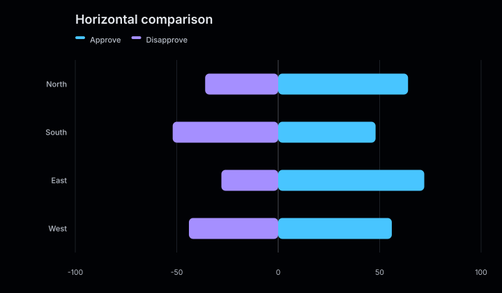
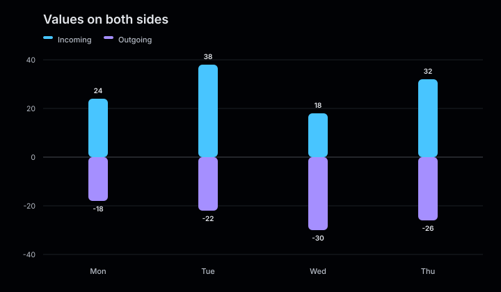
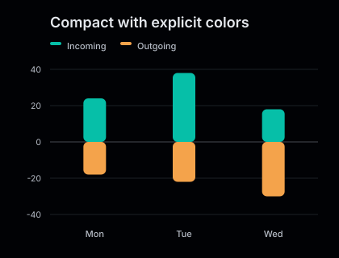

# Diverging bar charts

Diverging bars place exactly two series on opposite sides of zero. Supply both series as non-negative magnitudes and let the renderer assign their direction.

<figure class="product-output product-output--chart">

<figcaption>Two age-group series placed on opposite sides of a shared baseline.</figcaption>
</figure>

## Example

```php
<?php

declare(strict_types=1);

use Atelier\Chart\Chart;

require __DIR__.'/vendor/autoload.php';

$model = Chart::divergingBar()
    ->title('Population profile')
    ->description('Women to the right and men to the left by age group.')
    ->horizontal()
    ->showValues()
    ->series('Women', ['0-9' => 18, '10-19' => 22, '20-29' => 27])
    ->series('Men', ['0-9' => 20, '10-19' => 21, '20-29' => 25])
    ->build();

echo Chart::render($model);
```

## More examples

These snippets use the `Chart` import and Composer autoloader from the example above.

A diverging bar chart requires exactly two series of non-negative magnitudes.

### Horizontal comparison

<figure class="product-output product-output--chart">

<figcaption>horizontal() sends the first series right and the second left; all input magnitudes remain positive.</figcaption>
</figure>

```php
$model = Chart::divergingBar()
    ->title('Horizontal comparison')
    ->description('horizontal() sends the first series right and the second left; all input magnitudes remain positive.')
    ->horizontal()
    ->series('Approve', ['North' => 64, 'South' => 48, 'East' => 72, 'West' => 56])
    ->series('Disapprove', ['North' => 36, 'South' => 52, 'East' => 28, 'West' => 44])
    ->build();

echo Chart::render($model);
```

[Run this example](../../examples/variants/diverging-bar/horizontal.php).

### Values on both sides

<figure class="product-output product-output--chart">

<figcaption>showValues() labels the magnitudes above and below the zero line.</figcaption>
</figure>

```php
$model = Chart::divergingBar()
    ->title('Values on both sides')
    ->description('showValues() labels the magnitudes above and below the zero line.')
    ->showValues()
    ->series('Incoming', ['Mon' => 24, 'Tue' => 38, 'Wed' => 18, 'Thu' => 32])
    ->series('Outgoing', ['Mon' => 18, 'Tue' => 22, 'Wed' => 30, 'Thu' => 26])
    ->build();

echo Chart::render($model);
```

[Run this example](../../examples/variants/diverging-bar/value-labels.php).

### Compact with explicit colors

<figure class="product-output product-output--chart">

<figcaption>A 420 by 320 canvas uses teal and orange for two opposing series.</figcaption>
</figure>

```php
$model = Chart::divergingBar()
    ->title('Compact with explicit colors')
    ->description('A 420 by 320 canvas uses teal and orange for two opposing series.')
    ->size(420, 320)
    ->series('Incoming', ['Mon' => 24, 'Tue' => 38, 'Wed' => 18], '#06bfa8')
    ->series('Outgoing', ['Mon' => 18, 'Tue' => 22, 'Wed' => 30], '#f4a34b')
    ->build();

echo Chart::render($model);
```

[Run this example](../../examples/variants/diverging-bar/compact-colors.php).

## Configuration and behavior

- A diverging chart requires exactly two series and at least one positive magnitude.
- Both series must use the same unique, non-empty categories in the same order.
- Values must be non-negative. In a horizontal chart, the first series renders to the right and the second to the left. In a vertical chart, they render above and below zero.
- `showValues()` displays the second series with negative labels to reflect its rendered direction.
- `series()` accepts an optional color for each series.
- `size()` accepts dimensions of at least 320 by 240 pixels. The default is 720 by 420.

## When to use

Use diverging bars for paired magnitude comparisons such as population pyramids or two periods around a shared baseline. They are not intended for input data that already contains signed values.

The SVG renderer exposes the chart as an image with an accessible title and optional description. The output includes category labels, a zero baseline, and a `viewBox` matching the configured size.
