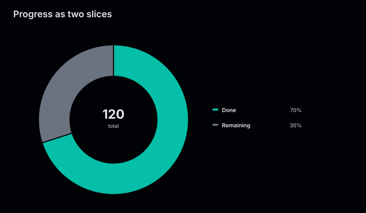
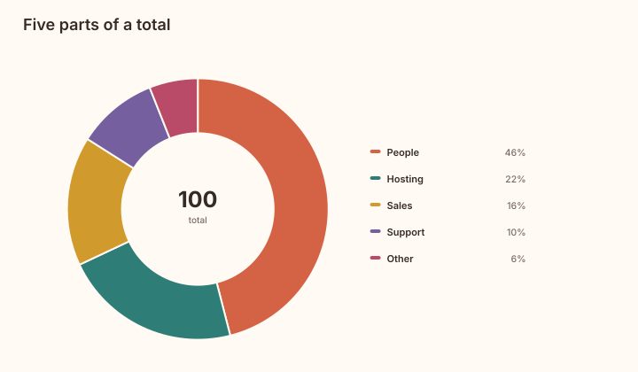
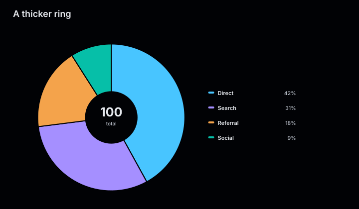

# Donut charts

Donut charts use the same composition model as pie charts, with an open center that
displays the sum of all slices.

<figure class="product-output product-output--chart">

<figcaption>Traffic sources rendered as proportional arcs around their total.</figcaption>
</figure>

## Example

```php
<?php

declare(strict_types=1);

use Atelier\Chart\Chart;

require __DIR__.'/vendor/autoload.php';

$model = Chart::donut()
    ->title('Traffic sources')
    ->description('Traffic share across acquisition sources.')
    ->slice('Direct', 42)
    ->slice('Search', 31)
    ->slice('Referral', 18)
    ->slice('Social', 9)
    ->build();

echo Chart::render($model);
```

## More examples

These snippets use the `Chart` import and Composer autoloader from the example above.

A donut contains one collection of slices. Vary the slices, colors, or canvas size rather than adding independent series.

### Progress as two slices

<figure class="product-output product-output--chart">

<figcaption>Completed and remaining work occupy 84 and 36 units; the center shows their total of 120.</figcaption>
</figure>

```php
$model = Chart::donut()
    ->title('Progress as two slices')
    ->description('Completed and remaining work occupy 84 and 36 units; the center shows their total of 120.')
    ->slice('Done', 84, '#06bfa8')
    ->slice('Remaining', 36, '#6b7280')
    ->build();

echo Chart::render($model);
```

[Run this example](../../examples/variants/donut/two-slices.php).

### Five parts of a total

<figure class="product-output product-output--chart">

<figcaption>Five spending categories surround the total, using the warm theme palette.</figcaption>
</figure>

```php
$model = Chart::donut()
    ->title('Five parts of a total')
    ->description('Five spending categories surround the total, using the warm theme palette.')
    ->slice('People', 46)
    ->slice('Hosting', 22)
    ->slice('Sales', 16)
    ->slice('Support', 10)
    ->slice('Other', 6)
    ->build();

echo Chart::render($model, Atelier\Chart\Theme\Theme::warm());
```

[Run this example](../../examples/variants/donut/five-slices.php).

### A thicker ring

<figure class="product-output product-output--chart">

<figcaption>PieChartBuilder(0.35) leaves a smaller hole than the default donut ratio of 0.58.</figcaption>
</figure>

```php
$model = (new Atelier\Chart\Builder\PieChartBuilder(0.35))
    ->title('A thicker ring')
    ->description('PieChartBuilder(0.35) leaves a smaller hole than the default donut ratio of 0.58.')
    ->slice('Direct', 42)
    ->slice('Search', 31)
    ->slice('Referral', 18)
    ->slice('Social', 9)
    ->build();

echo Chart::render($model);
```

[Run this example](../../examples/variants/donut/thick-ring.php).

## Configuration and behavior

- `slice()` accepts a unique label, a positive finite value, and an optional color.
- Values are converted to shares of their total and do not need to add up to 100.
- `Chart::donut()` uses an inner radius equal to 58 percent of the outer radius.
- The center shows the raw total. The legend shows each label and calculated
  percentage.
- The default canvas is 720 by 420. Use `size($width, $height)` for another size;
  donut charts must be at least 280 by 240.

## When to use

Use a donut chart for a small composition when showing the total in the center adds
useful context. Use a bar chart for more categories or more exact comparisons.

The SVG includes an accessible title and data summary. With `SvgRenderOptions(dataAttributes: true)`,
chart marks also carry `data-*` attributes. Each arc exposes its label, value, and ratio.