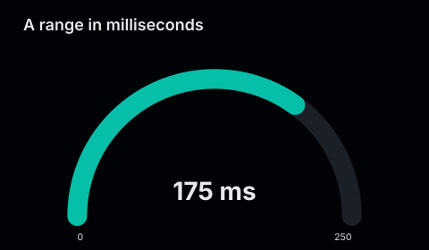
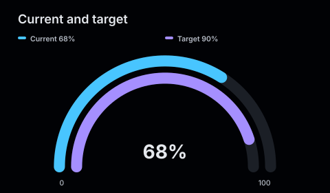
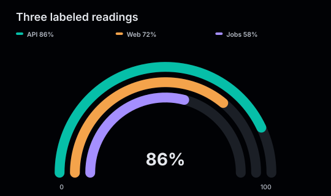

# Gauges

A gauge shows a current value within a fixed numeric range. Add up to two comparison series to render concentric arcs on the same scale.

<figure class="product-output product-output--chart">

<figcaption>Release confidence and two comparisons rendered as concentric bounded arcs.</figcaption>
</figure>

## Example

```php
<?php

declare(strict_types=1);

use Atelier\Chart\Chart;

require __DIR__.'/vendor/autoload.php';

$model = Chart::gauge(78)
    ->title('Release confidence')
    ->description('Overall confidence compared with quality and readiness.')
    ->label('Overall')
    ->range(0, 100)
    ->unit('%')
    ->series('Quality', 86)
    ->series('Readiness', 71)
    ->size(480, 280)
    ->build();

echo Chart::render($model);
```

## More examples

These snippets use the `Chart` import and Composer autoloader from the example above.

### A range in milliseconds

<figure class="product-output product-output--chart">

<figcaption>range(0, 250) makes 175 ms occupy seventy percent of the arc.</figcaption>
</figure>

```php
$model = Chart::gauge(175)
    ->title('A range in milliseconds')
    ->description('range(0, 250) makes 175 ms occupy seventy percent of the arc.')
    ->range(0, 250)
    ->unit(' ms')
    ->color('#06bfa8')
    ->label('Latency')
    ->size(480, 280)
    ->build();

echo Chart::render($model);
```

[Run this example](../../examples/variants/gauge/custom-range.php).

### Current and target

<figure class="product-output product-output--chart">

<figcaption>Adding one series draws a second arc for the target on the same 0 to 100 range.</figcaption>
</figure>

```php
$model = Chart::gauge(68)
    ->title('Current and target')
    ->description('Adding one series draws a second arc for the target on the same 0 to 100 range.')
    ->label('Current')
    ->series('Target', 90)
    ->unit('%')
    ->size(480, 280)
    ->build();

echo Chart::render($model);
```

[Run this example](../../examples/variants/gauge/two-series.php).

### Three labeled readings

<figure class="product-output product-output--chart">

<figcaption>The main value and two comparison series form three separately colored arcs.</figcaption>
</figure>

```php
$model = Chart::gauge(86)
    ->title('Three labeled readings')
    ->description('The main value and two comparison series form three separately colored arcs.')
    ->label('API')
    ->color('#06bfa8')
    ->series('Web', 72, '#f4a34b')
    ->series('Jobs', 58, '#a58fff')
    ->unit('%')
    ->size(540, 320)
    ->build();

echo Chart::render($model);
```

[Run this example](../../examples/variants/gauge/three-series.php).

## Configuration and behavior

- `Chart::gauge()` receives the primary value. The default range is 0 to 100.
- `range()` requires a minimum lower than the maximum. Every value must be finite and inside that range.
- `label()` names the primary series. `series()` adds up to two comparisons, for three arcs in total.
- `unit()` appends text such as `%` or ` ms` to displayed values.
- `color()` sets the primary arc color. Each comparison can also receive an optional color.
- `size()` accepts dimensions of at least 240 by 160 pixels. The default is 360 by 220.

The renderer displays the current value, range bounds, and comparison labels. A value at the range minimum leaves its value arc empty while retaining the track.

## When to use

Use a gauge for one bounded status value, optionally compared with one or two related measurements. Prefer a bar or line chart when exact comparison across many values matters.

The rendered SVG has `role="img"`, an accessible title, and the supplied description. Its explicit dimensions and matching `viewBox` preserve the chart geometry when scaled.
