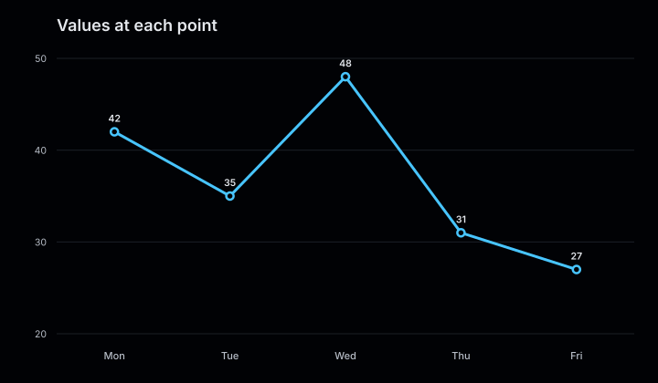
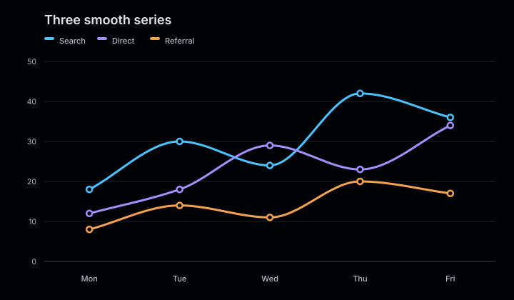
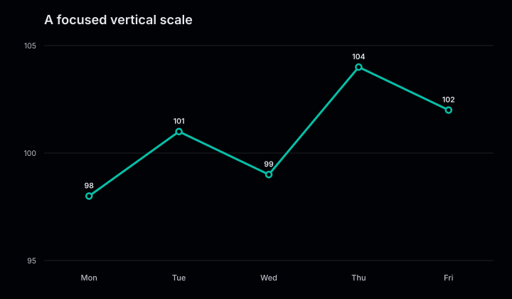

# Line charts

Line charts show how values change across ordered categories. Each series is rendered
as a line with a point at every supplied value.

<figure class="product-output product-output--chart">

<figcaption>Two weekly series rendered with lines, points, axes, and a shared legend.</figcaption>
</figure>

## Example

```php
<?php

declare(strict_types=1);

use Atelier\Chart\Chart;

require __DIR__.'/vendor/autoload.php';

$model = Chart::line()
    ->title('Weekly signups')
    ->description('Organic and referral signups from Monday to Friday.')
    ->smooth()
    ->series('Organic', ['Mon' => 12, 'Tue' => 18, 'Wed' => 16, 'Thu' => 25, 'Fri' => 31])
    ->series('Referral', ['Mon' => 8, 'Tue' => 11, 'Wed' => 14, 'Thu' => 13, 'Fri' => 19])
    ->build();

echo Chart::render($model);
```

## More examples

These snippets use the `Chart` import and Composer autoloader from the example above.

### Values at each point

<figure class="product-output product-output--chart">

<figcaption>showValues() prints the five measurements along a single straight-segment line.</figcaption>
</figure>

```php
$model = Chart::line()
    ->title('Values at each point')
    ->description('showValues() prints the five measurements along a single straight-segment line.')
    ->showValues()
    ->series('Latency', ['Mon' => 42, 'Tue' => 35, 'Wed' => 48, 'Thu' => 31, 'Fri' => 27])
    ->build();

echo Chart::render($model);
```

[Run this example](../../examples/variants/line/value-labels.php).

### Three smooth series

<figure class="product-output product-output--chart">

<figcaption>smooth() connects three weekly series with curves; the legend names each channel.</figcaption>
</figure>

```php
$model = Chart::line()
    ->title('Three smooth series')
    ->description('smooth() connects three weekly series with curves; the legend names each channel.')
    ->smooth()
    ->series('Search', ['Mon' => 18, 'Tue' => 30, 'Wed' => 24, 'Thu' => 42, 'Fri' => 36])
    ->series('Direct', ['Mon' => 12, 'Tue' => 18, 'Wed' => 29, 'Thu' => 23, 'Fri' => 34])
    ->series('Referral', ['Mon' => 8, 'Tue' => 14, 'Wed' => 11, 'Thu' => 20, 'Fri' => 17])
    ->build();

echo Chart::render($model);
```

[Run this example](../../examples/variants/line/three-smooth-series.php).

### A focused vertical scale

<figure class="product-output product-output--chart">

<figcaption>domain(95, 105) shows small changes around 100 instead of extending the axis to zero.</figcaption>
</figure>

```php
$model = Chart::line()
    ->title('A focused vertical scale')
    ->description('domain(95, 105) shows small changes around 100 instead of extending the axis to zero.')
    ->domain(95, 105)
    ->showValues()
    ->series('Index', ['Mon' => 98, 'Tue' => 101, 'Wed' => 99, 'Thu' => 104, 'Fri' => 102], '#06bfa8')
    ->build();

echo Chart::render($model);
```

[Run this example](../../examples/variants/line/fixed-domain.php).

## Configuration and behavior

- Categories come from the keys passed to `series()` and retain their supplied order.
  Every series must use the same categories in the same order.
- Lines are straight by default. `smooth()` enables monotone cubic interpolation that
  passes through every data point without overshooting between adjacent points.
- Positive and negative values share a scale fitted to their data. Call `includeZero()` to extend an automatic domain to zero.
- Value labels are hidden by default. Use `showValues()` to display them.
- Pass an optional color as the third argument to `series()`, or render with one of the
  included themes.

## When to use

Use a line chart for a sequence where order matters, such as daily activity or values
across stages. A bar chart is usually clearer when categories have no natural order.

The SVG includes a `viewBox`, explicit dimensions, accessible title metadata, and a data summary.
Enable `SvgRenderOptions(dataAttributes: true)` to add `data-series`, `data-category`, and
`data-value` to each point.