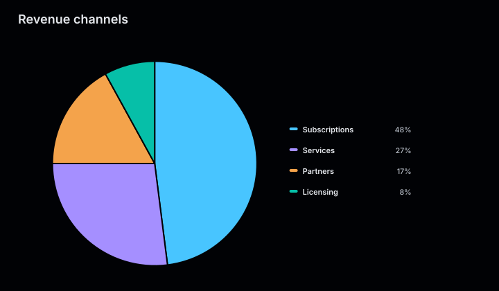
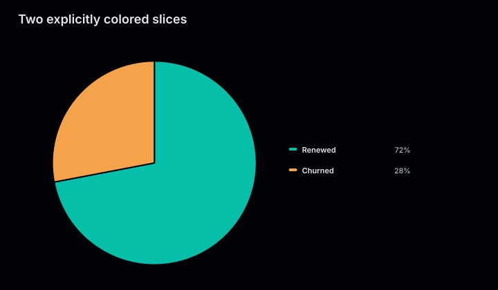
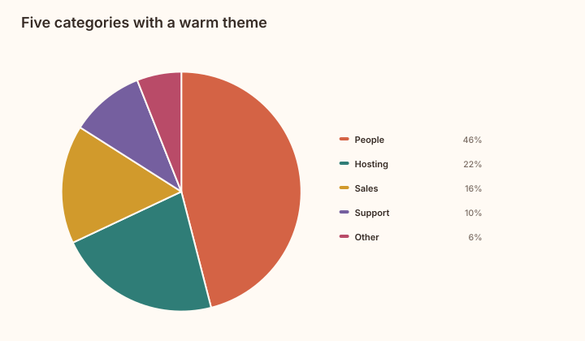
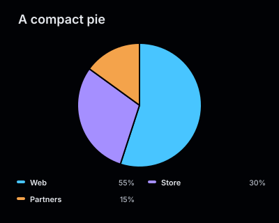

# Pie charts

Pie charts show the share of a total contributed by each category. The renderer draws
one proportional slice per value and lists every category with its computed percentage.

<figure class="product-output product-output--chart">

<figcaption>Four revenue channels rendered as proportional slices with percentages.</figcaption>
</figure>

## Example

```php
<?php

declare(strict_types=1);

use Atelier\Chart\Chart;

require __DIR__.'/vendor/autoload.php';

$model = Chart::pie()
    ->title('Revenue channels')
    ->description('Revenue share across four sales channels.')
    ->slice('Subscriptions', 48)
    ->slice('Services', 27)
    ->slice('Partners', 17)
    ->slice('Licensing', 8)
    ->build();

echo Chart::render($model);
```

## More examples

These snippets use the `Chart` import and Composer autoloader from the example above.

A pie contains one collection of slices. Vary the slices, colors, or canvas size rather than adding independent series.

### Two explicitly colored slices

<figure class="product-output product-output--chart">

<figcaption>Two slices split the circle 72 to 28, with colors supplied to slice().</figcaption>
</figure>

```php
$model = Chart::pie()
    ->title('Two explicitly colored slices')
    ->description('Two slices split the circle 72 to 28, with colors supplied to slice().')
    ->slice('Renewed', 72, '#06bfa8')
    ->slice('Churned', 28, '#f4a34b')
    ->build();

echo Chart::render($model);
```

[Run this example](../../examples/variants/pie/two-slices.php).

### Five categories with a warm theme

<figure class="product-output product-output--chart">

<figcaption>Five budget categories use Theme::warm(), including its light background and palette.</figcaption>
</figure>

```php
$model = Chart::pie()
    ->title('Five categories with a warm theme')
    ->description('Five budget categories use Theme::warm(), including its light background and palette.')
    ->slice('People', 46)
    ->slice('Hosting', 22)
    ->slice('Sales', 16)
    ->slice('Support', 10)
    ->slice('Other', 6)
    ->build();

echo Chart::render($model, Atelier\Chart\Theme\Theme::warm());
```

[Run this example](../../examples/variants/pie/five-slices.php).

### A compact pie

<figure class="product-output product-output--chart">

<figcaption>size(400, 320) fits three slices and their legend into a smaller canvas.</figcaption>
</figure>

```php
$model = Chart::pie()
    ->title('A compact pie')
    ->description('size(400, 320) fits three slices and their legend into a smaller canvas.')
    ->size(400, 320)
    ->slice('Web', 55)
    ->slice('Store', 30)
    ->slice('Partners', 15)
    ->build();

echo Chart::render($model);
```

[Run this example](../../examples/variants/pie/compact.php).

## Configuration and behavior

- `slice()` accepts a unique label, a positive finite value, and an optional color.
- Values do not need to add up to 100. Percentages are calculated from their total.
- Add at least one slice before calling `build()`.
- The renderer places the legend beside the pie on wide canvases and below it on
  narrower canvases.
- The default canvas is 720 by 420. Use `size($width, $height)` for another size;
  pie charts must be at least 280 by 240.

## When to use

Use a pie chart for a small set of positive parts that form one meaningful whole. Use
a bar chart when precise comparison matters or when there are many categories.

The SVG includes an accessible title and data summary. With `SvgRenderOptions(dataAttributes: true)`,
chart marks also carry `data-*` attributes. Each slice exposes its label, value, and ratio.