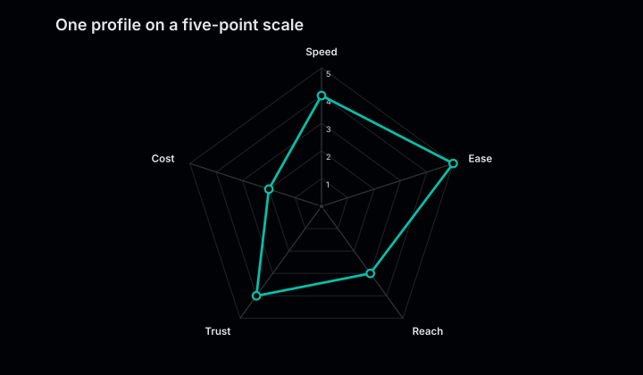
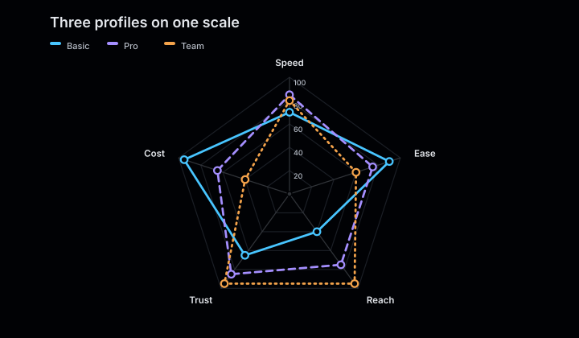
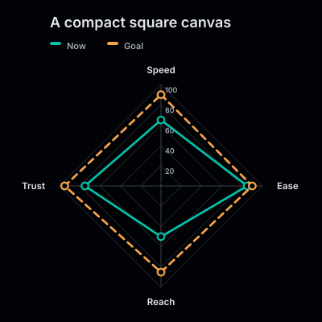

# Radar charts

Radar charts compare profiles across three or more numeric dimensions. Each category
becomes a radial axis and each series becomes a stroked profile.

<figure class="product-output product-output--chart">

<figcaption>Two multivariate profiles rendered against the same five radial axes.</figcaption>
</figure>

## Example

```php
<?php

declare(strict_types=1);

use Atelier\Chart\Chart;

require __DIR__.'/vendor/autoload.php';

$model = Chart::radar()
    ->title('Product profile')
    ->description('Current qualities compared with the target profile.')
    ->series('Current', [
        'Clarity' => 82,
        'Speed' => 92,
        'Reach' => 61,
        'Trust' => 88,
        'Craft' => 70,
    ])
    ->series('Target', [
        'Clarity' => 94,
        'Speed' => 74,
        'Reach' => 86,
        'Trust' => 76,
        'Craft' => 92,
    ])
    ->build();

echo Chart::render($model);
```

## More examples

These snippets use the `Chart` import and Composer autoloader from the example above.

### One profile on a five-point scale

<figure class="product-output product-output--chart">

<figcaption>domain(0, 5) fixes the outer ring at five for all five qualities.</figcaption>
</figure>

```php
$model = Chart::radar()
    ->title('One profile on a five-point scale')
    ->description('domain(0, 5) fixes the outer ring at five for all five qualities.')
    ->domain(0, 5)
    ->series('Studio', ['Speed' => 4, 'Ease' => 5, 'Reach' => 3, 'Trust' => 4, 'Cost' => 2], '#06bfa8')
    ->build();

echo Chart::render($model);
```

[Run this example](../../examples/variants/radar/five-point-scale.php).

### Three profiles on one scale

<figure class="product-output product-output--chart">

<figcaption>Three polygons use the same 0 to 100 scale so their shapes can be compared directly.</figcaption>
</figure>

```php
$model = Chart::radar()
    ->title('Three profiles on one scale')
    ->description('Three polygons use the same 0 to 100 scale so their shapes can be compared directly.')
    ->domain(0, 100)
    ->series('Basic', ['Speed' => 70, 'Ease' => 90, 'Reach' => 40, 'Trust' => 65, 'Cost' => 95])
    ->series('Pro', ['Speed' => 85, 'Ease' => 75, 'Reach' => 75, 'Trust' => 85, 'Cost' => 65])
    ->series('Team', ['Speed' => 80, 'Ease' => 60, 'Reach' => 95, 'Trust' => 95, 'Cost' => 40])
    ->build();

echo Chart::render($model);
```

[Run this example](../../examples/variants/radar/three-profiles.php).

### A compact square canvas

<figure class="product-output product-output--chart">

<figcaption>size(400, 400) puts two explicitly colored profiles on a square canvas.</figcaption>
</figure>

```php
$model = Chart::radar()
    ->title('A compact square canvas')
    ->description('size(400, 400) puts two explicitly colored profiles on a square canvas.')
    ->size(400, 400)
    ->domain(0, 100)
    ->series('Now', ['Speed' => 65, 'Ease' => 85, 'Reach' => 50, 'Trust' => 75], '#06bfa8')
    ->series('Goal', ['Speed' => 90, 'Ease' => 90, 'Reach' => 85, 'Trust' => 95], '#f4a34b')
    ->build();

echo Chart::render($model);
```

[Run this example](../../examples/variants/radar/compact.php).

## Configuration and behavior

- Radar charts require at least three unique, non-empty categories.
- Values must be finite and non-negative. All series must use the same categories in
  the same order.
- The renderer includes zero in the shared scale and draws five reference levels.
- Multiple series receive a legend, distinct stroke patterns, and hollow points. Series
  have no area fill, so crossings and the reference web remain visible.
- Value labels are hidden by default. Enable them with `showValues()` when the chart
  has enough room.
- `smooth()` is not available for radar charts.

## When to use

Use a radar chart to compare a few profiles measured on the same scale. Keep the axis
count limited and use a bar chart when precise comparisons between individual values
are more important than the overall shape.

The SVG includes an accessible title and data summary. With `SvgRenderOptions(dataAttributes: true)`,
each series path and point exposes its data through `data-*` attributes.