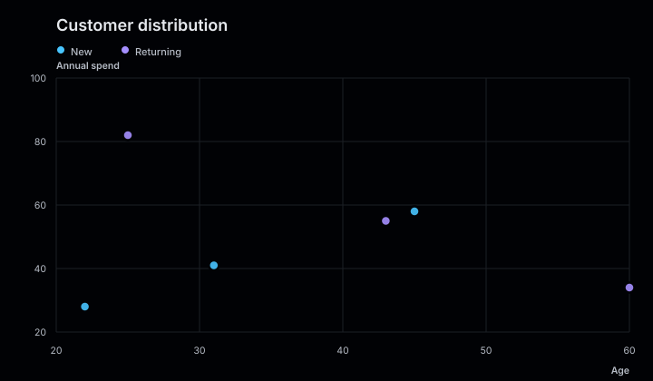
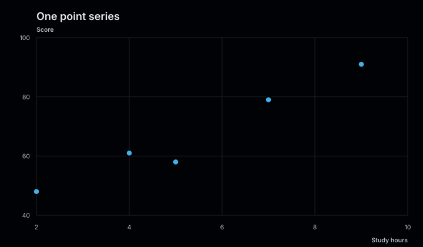
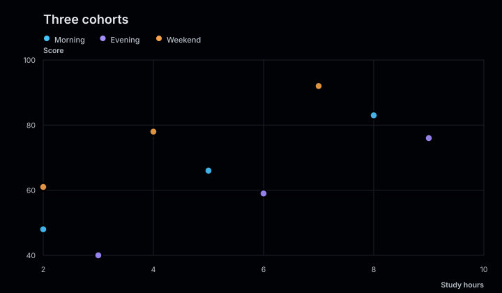
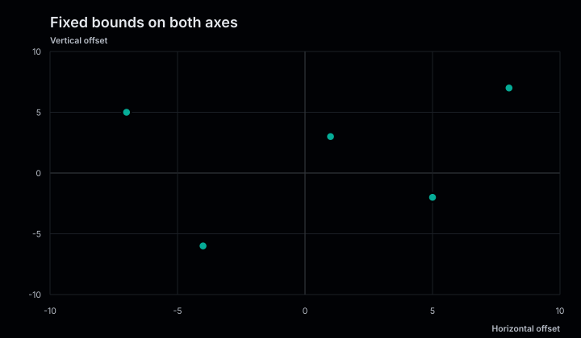

# Scatter plots

Scatter plots reveal relationships, clusters, and outliers across two numeric
variables. Each series can represent a different group within the same coordinate
space.

<figure class="product-output product-output--chart">

<figcaption>Two customer groups plotted against shared age and spending axes.</figcaption>
</figure>

## Example

```php
<?php

declare(strict_types=1);

use Atelier\Chart\Chart;

require __DIR__.'/vendor/autoload.php';

$model = Chart::scatter()
    ->title('Customer distribution')
    ->description('Customer age compared with annual spend in thousands.')
    ->axes('Age', 'Annual spend')
    ->series('New', [
        ['x' => 22, 'y' => 28],
        ['x' => 31, 'y' => 41],
        ['x' => 45, 'y' => 58],
    ])
    ->series('Returning', [
        ['x' => 25, 'y' => 82],
        ['x' => 43, 'y' => 55],
        ['x' => 60, 'y' => 34],
    ])
    ->build();

echo Chart::render($model);
```

## More examples

These snippets use the `Chart` import and Composer autoloader from the example above.

### One point series

<figure class="product-output product-output--chart">

<figcaption>A single series plots study hours against scores, with explicit axis labels.</figcaption>
</figure>

```php
$model = Chart::scatter()
    ->title('One point series')
    ->description('A single series plots study hours against scores, with explicit axis labels.')
    ->axes('Study hours', 'Score')
    ->series('Students', [['x' => 2, 'y' => 48], ['x' => 4, 'y' => 61], ['x' => 5, 'y' => 58], ['x' => 7, 'y' => 79], ['x' => 9, 'y' => 91]])
    ->build();

echo Chart::render($model);
```

[Run this example](../../examples/variants/scatter/one-series.php).

### Three cohorts

<figure class="product-output product-output--chart">

<figcaption>Three colored point series compare the same two measurements across cohorts.</figcaption>
</figure>

```php
$model = Chart::scatter()
    ->title('Three cohorts')
    ->description('Three colored point series compare the same two measurements across cohorts.')
    ->axes('Study hours', 'Score')
    ->series('Morning', [['x' => 2, 'y' => 48], ['x' => 5, 'y' => 66], ['x' => 8, 'y' => 83]])
    ->series('Evening', [['x' => 3, 'y' => 40], ['x' => 6, 'y' => 59], ['x' => 9, 'y' => 76]])
    ->series('Weekend', [['x' => 2, 'y' => 61], ['x' => 4, 'y' => 78], ['x' => 7, 'y' => 92]])
    ->build();

echo Chart::render($model);
```

[Run this example](../../examples/variants/scatter/three-series.php).

### Fixed bounds on both axes

<figure class="product-output product-output--chart">

<figcaption>xDomain(-10, 10) and yDomain(-10, 10) show signed offsets on matching scales.</figcaption>
</figure>

```php
$model = Chart::scatter()
    ->title('Fixed bounds on both axes')
    ->description('xDomain(-10, 10) and yDomain(-10, 10) show signed offsets on matching scales.')
    ->axes('Horizontal offset', 'Vertical offset')
    ->xDomain(-10, 10)
    ->yDomain(-10, 10)
    ->series('Samples', [['x' => -7, 'y' => 5], ['x' => -4, 'y' => -6], ['x' => 1, 'y' => 3], ['x' => 5, 'y' => -2], ['x' => 8, 'y' => 7]], '#06bfa8')
    ->build();

echo Chart::render($model);
```

[Run this example](../../examples/variants/scatter/fixed-domains.php).

## Configuration and behavior

- Each point passed to `series()` requires finite numeric `x` and `y` values.
- Pass an optional series color as the third argument to `series()`.
- `axes()` adds optional labels for the horizontal and vertical axes.
- Both linear axes fit their domains to all points and derive readable tick intervals. Call `includeZero()` to extend both automatic domains to zero.
- A legend is rendered when the chart contains more than one series.
- The default canvas is 720 by 420. Point charts must be at least 320 by 240.

## When to use

Use a scatter plot to examine the relationship between two quantitative variables.
Use a line chart instead when the points form an ordered sequence.

The SVG includes an accessible title and data summary. With `SvgRenderOptions(dataAttributes: true)`,
chart marks also carry `data-*` attributes. Each point exposes its series and coordinates.