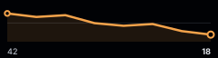
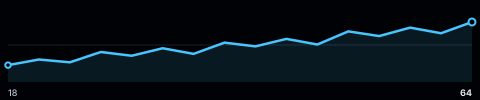
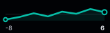

# Sparklines

A sparkline summarizes the shape of an ordered series in a compact SVG. It omits axes and category labels, making it suitable beside a metric or inside a dense table.

<figure class="product-output product-output--chart">

<figcaption>A compact trend with its mean guide and first and last values.</figcaption>
</figure>

## Example

```php
<?php

declare(strict_types=1);

use Atelier\Chart\Chart;

require __DIR__.'/vendor/autoload.php';

$model = Chart::sparkline([14, 18, 16, 24, 22, 31, 36])
    ->title('Seven day signups')
    ->description('Signups generally rose across seven consecutive days.')
    ->color('#5a67d8')
    ->size(240, 64)
    ->build();

echo Chart::render($model);
```

## More examples

These snippets use the `Chart` import and Composer autoloader from the example above.

This chart takes one series. These examples vary its data and rendering options.

### A falling trend in orange

<figure class="product-output product-output--chart">

<figcaption>color() gives this falling sequence an explicit orange stroke.</figcaption>
</figure>

```php
$model = Chart::sparkline([42, 38, 40, 31, 28, 30, 22, 18])
    ->title('A falling trend in orange')
    ->description('color() gives this falling sequence an explicit orange stroke.')
    ->color('#f4a34b')
    ->build();

echo Chart::render($model);
```

[Run this example](../../examples/variants/sparkline/custom-color.php).

### A wider trend

<figure class="product-output product-output--chart">

<figcaption>size(480, 100) gives sixteen observations more horizontal space.</figcaption>
</figure>

```php
$model = Chart::sparkline([18, 24, 21, 32, 28, 36, 30, 42, 38, 46, 40, 54, 49, 58, 52, 64])
    ->title('A wider trend')
    ->description('size(480, 100) gives sixteen observations more horizontal space.')
    ->size(480, 100)
    ->build();

echo Chart::render($model);
```

[Run this example](../../examples/variants/sparkline/wide.php).

### A compact signed sequence

<figure class="product-output product-output--chart">

<figcaption>size(160, 48) fits gains and losses into a small inline chart; no axes are drawn.</figcaption>
</figure>

```php
$model = Chart::sparkline([-8, -3, 4, -2, 7, 3, 12, 6])
    ->title('A compact signed sequence')
    ->description('size(160, 48) fits gains and losses into a small inline chart; no axes are drawn.')
    ->size(160, 48)
    ->color('#06bfa8')
    ->build();

echo Chart::render($model);
```

[Run this example](../../examples/variants/sparkline/compact-signed.php).

## Configuration and behavior

- Values are plotted in list order. A sparkline requires at least two finite numbers.
- `color()` overrides the first color supplied by the active theme.
- The renderer draws a straight line, a translucent area, a mean guide, and markers at the first and last values.
- The first and last values are labeled when the height is at least 48 pixels.
- `size()` accepts dimensions of at least 80 by 24 pixels. The default is 240 by 64.

## When to use

Use a sparkline to show direction and variation when the surrounding interface already supplies the metric and time context. Use a full line chart when readers need axes, categories, or multiple series.

The visible plot stays compact, while the SVG root still carries `role="img"`, the chart title, and the optional description for assistive technology. A matching `viewBox` supports scaling.
