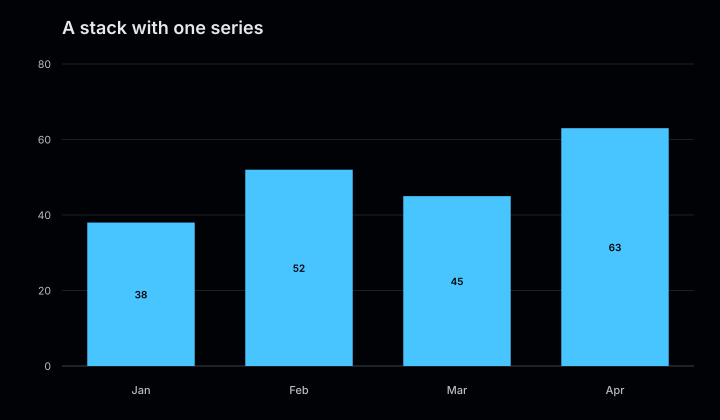
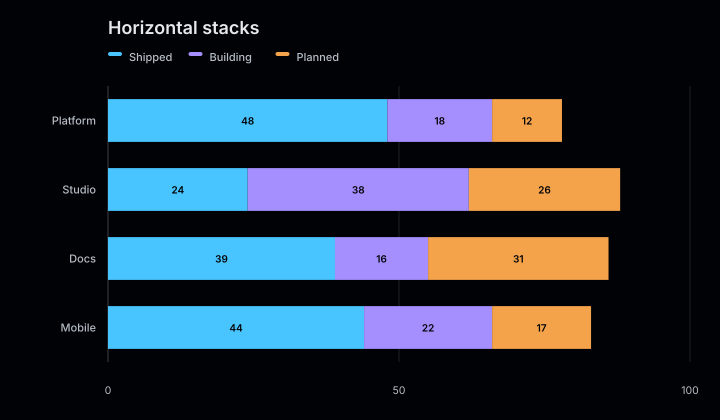
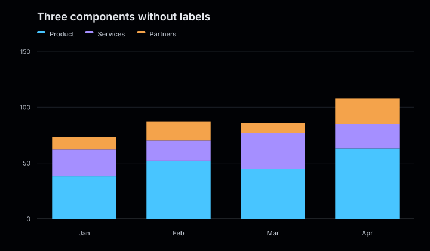

# Stacked bar charts

Stacked bars show how several non-negative series contribute to each category total. Charts are vertical by default and can be switched to a horizontal layout.

<figure class="product-output product-output--chart">

<figcaption>Each product area combines shipped, in-progress, and planned work in one stack.</figcaption>
</figure>

## Example

```php
<?php

declare(strict_types=1);

use Atelier\Chart\Chart;

require __DIR__.'/vendor/autoload.php';

$model = Chart::stackedBar()
    ->title('Roadmap allocation')
    ->description('Work allocation by product area and delivery state.')
    ->horizontal()
    ->showValues()
    ->series('Shipped', ['Platform' => 48, 'Studio' => 24, 'Docs' => 39])
    ->series('In progress', ['Platform' => 18, 'Studio' => 38, 'Docs' => 16])
    ->series('Planned', ['Platform' => 12, 'Studio' => 26, 'Docs' => 31])
    ->build();

echo Chart::render($model);
```

## More examples

These snippets use the `Chart` import and Composer autoloader from the example above.

### A stack with one series

<figure class="product-output product-output--chart">

<figcaption>One series produces a single segment per category, ready for more components to be added.</figcaption>
</figure>

```php
$model = Chart::stackedBar()
    ->title('A stack with one series')
    ->description('One series produces a single segment per category, ready for more components to be added.')
    ->showValues()
    ->series('Product', ['Jan' => 38, 'Feb' => 52, 'Mar' => 45, 'Apr' => 63])
    ->build();

echo Chart::render($model);
```

[Run this example](../../examples/variants/stacked-bar/one-series.php).

### Horizontal stacks

<figure class="product-output product-output--chart">

<figcaption>horizontal() places category labels on the left and stacks three components across each row.</figcaption>
</figure>

```php
$model = Chart::stackedBar()
    ->title('Horizontal stacks')
    ->description('horizontal() places category labels on the left and stacks three components across each row.')
    ->horizontal()
    ->showValues()
    ->series('Shipped', ['Platform' => 48, 'Studio' => 24, 'Docs' => 39, 'Mobile' => 44])
    ->series('Building', ['Platform' => 18, 'Studio' => 38, 'Docs' => 16, 'Mobile' => 22])
    ->series('Planned', ['Platform' => 12, 'Studio' => 26, 'Docs' => 31, 'Mobile' => 17])
    ->build();

echo Chart::render($model);
```

[Run this example](../../examples/variants/stacked-bar/horizontal.php).

### Three components without labels

<figure class="product-output product-output--chart">

<figcaption>showValues(false) leaves the colored segments and legend without numbers inside the bars.</figcaption>
</figure>

```php
$model = Chart::stackedBar()
    ->title('Three components without labels')
    ->description('showValues(false) leaves the colored segments and legend without numbers inside the bars.')
    ->showValues(false)
    ->series('Product', ['Jan' => 38, 'Feb' => 52, 'Mar' => 45, 'Apr' => 63])
    ->series('Services', ['Jan' => 24, 'Feb' => 18, 'Mar' => 32, 'Apr' => 22])
    ->series('Partners', ['Jan' => 11, 'Feb' => 17, 'Mar' => 9, 'Apr' => 23])
    ->build();

echo Chart::render($model);
```

[Run this example](../../examples/variants/stacked-bar/no-labels.php).

## Configuration and behavior

- `series()` accepts a name, category-value pairs, and an optional color.
- The first series defines the categories. Every later series must use the same categories in the same order.
- Values must be non-negative. Use a diverging bar chart for paired magnitudes on opposite sides of zero.
- Use `horizontal()` or `vertical()` to choose the orientation.
- `showValues()` adds labels only when a rendered segment has enough room.
- `size()` accepts dimensions of at least 240 by 180 pixels. The default is 720 by 420.

## When to use

Use stacked bars when both the category totals and the contribution of each series matter. Use grouped bars when comparing individual series is more important than the total.

The SVG renderer adds `role="img"`, an accessible title, and the supplied description. It also emits a matching `viewBox` for the configured dimensions.
