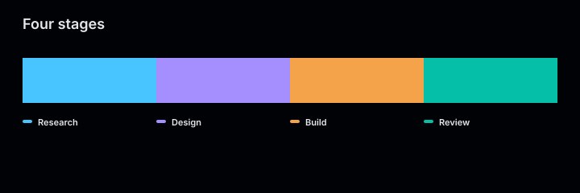
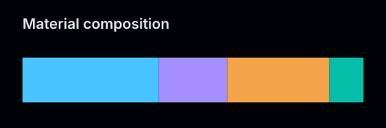
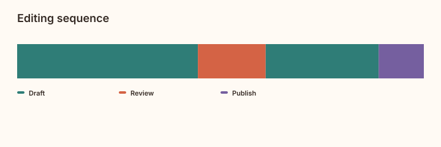

# Strip charts

A strip shows an ordered sequence of colored segments. Each segment has a positive
weight and a label; its share of the total weight determines its share of the width.
Labels are free text, and weights have no imposed unit.

<figure class="product-output product-output--chart">

<figcaption>Weights 12, 3, and 9 occupy 50%, 12.5%, and 37.5% of the width. Both Production segments keep the same color.</figcaption>
</figure>

## Example

```php
<?php

declare(strict_types=1);

use Atelier\Chart\Chart;

require __DIR__.'/vendor/autoload.php';

$model = Chart::strip()
    ->title('Production cycle')
    ->description('Production, pause, then production again, weighted 12 to 3 to 9.')
    ->segment(weight: 12, label: 'Production', color: '#06bfa8')
    ->segment(weight: 3, label: 'Pause', color: '#f4a34b')
    ->segment(weight: 9, label: 'Production', color: '#06bfa8')
    ->build();

echo Chart::render($model);
```

[Full PHP example](../../examples/strip.php).

## More examples

These snippets reuse the `Chart` import and Composer autoloader above.

### Equal weights

<figure class="product-output product-output--chart">

<figcaption>Four equal weights produce four equal-width segments, with colors taken from the theme palette.</figcaption>
</figure>

```php
$model = Chart::strip()
    ->title('Four stages')
    ->description('Four stages with equal weights.')
    ->segment(1, 'Research')
    ->segment(1, 'Design')
    ->segment(1, 'Build')
    ->segment(1, 'Review')
    ->build();

echo Chart::render($model);
```

[Full PHP example](../../examples/variants/strip/equal-weights.php).

### A compact strip without a legend

<figure class="product-output product-output--chart">

<figcaption>withoutLegend() leaves only the title and weighted segments on a 480 by 160 canvas.</figcaption>
</figure>

```php
$model = Chart::strip()
    ->title('Material composition')
    ->description('Four materials weighted 4 to 2 to 3 to 1.')
    ->withoutLegend()
    ->size(480, 160)
    ->segment(4, 'Paper')
    ->segment(2, 'Ink')
    ->segment(3, 'Fabric')
    ->segment(1, 'Glue')
    ->build();

echo Chart::render($model);
```

[Full PHP example](../../examples/variants/strip/without-legend.php).

### A custom palette with repeated labels

<figure class="product-output product-output--chart">

<figcaption>The two Draft segments share one palette color and one legend entry, while their weights remain separate.</figcaption>
</figure>

```php
$model = Chart::strip()
    ->title('Editing sequence')
    ->description('Draft, review, another draft, then publication.')
    ->segment(8, 'Draft')
    ->segment(3, 'Review')
    ->segment(5, 'Draft')
    ->segment(2, 'Publish')
    ->build();

echo Chart::render($model, Atelier\Chart\Theme\Theme::warm()->with(
    palette: ['#2f7d77', '#d46345', '#755f9f'],
));
```

[Full PHP example](../../examples/variants/strip/custom-palette.php).

## Configuration and behavior

| Setting | Default | Effect |
| --- | --- | --- |
| `segment(float $weight, string $label, ?string $color)` | required | appends a segment in input order; color defaults to the theme palette |
| `title(string)` | `Strip` | heading above the strip |
| `description(string)` | none | accessible description of the data |
| `withoutLegend()` | legend shown | hides the label and color key |
| `size(float, float)` | 720 by 240 | canvas size; minimum 320 by 160 |

Weights must be positive and finite, and their sum must remain finite. The builder
rejects empty labels and empty explicit colors. `build()` produces an immutable
`StripChart`; `totalWeight()` returns the sum of all segment weights.

Segments are never sorted or merged. Repeating a label preserves each segment and its
position. Without an explicit color, each distinct label receives a palette color in
first-appearance order. An explicit color overrides only that segment. The legend lists
each distinct label/color pair once, in first-appearance order.

Widths depend on ratios: multiplying every weight by the same factor leaves the drawing
unchanged. Segments fill the available width without gaps. A very small weight can be
narrower than a screen pixel; the renderer does not enforce a minimum visible width that
would change the proportions.

The legend wraps on narrow canvases. A canvas too short for its rows or too narrow for a
label is rejected; increase its size or use `withoutLegend()`.

With `SvgRenderOptions(dataAttributes: true)`, the SVG exposes `data-label`, `data-weight`, and `data-ratio` on each segment. The accessible
data summary preserves every label and weight in input order. The renderer adds no time
axis, current state, or calculated business metric.

## Migrating from Status

`Chart::strip()` replaces `Chart::status()`. Replace each `period()` call with a
`segment(weight: ..., label: ..., color: ...)` call. Use the former duration as the
weight if relative elapsed time is what the application needs to show.

`StatusState` and the `statusColors` theme map are removed. Supply application labels and
segment colors, or let the regular theme palette distinguish labels. Availability,
incident classification, and other domain calculations belong in application code.

## When to use

Use a strip for a weighted sequence, such as production phases, materials, or editing
passes. An [activity chart](activity.md) gives every cell the same width and encodes its
value as intensity; a strip encodes its weight as width. A [stacked bar](stacked-bar.md)
compares component totals across several categories.
