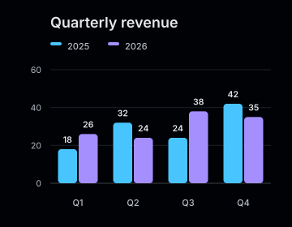

# Sizing

`size($width, $height)` defines both the rendered SVG dimensions and the coordinate
space used for layout. The renderer recalculates the complete chart for that size.

<div class="figure-grid">
<figure class="product-output product-output--chart">

<figcaption>Default size: 720 by 420.</figcaption>
</figure>
<figure class="product-output product-output--chart">

<figcaption>Compact size: 360 by 280.</figcaption>
</figure>
</div>

```php
$model = Chart::bar()
    ->size(480, 320)
    ->series('Revenue', ['Q1' => 18, 'Q2' => 32, 'Q3' => 24])
    ->build();
```

## SVG dimensions

The root SVG receives explicit `width` and `height` attributes plus a matching
`viewBox`. CSS can scale that document proportionally, but CSS scaling does not run the
PHP layout again.

For a compact layout, render a model with compact dimensions. Do not render a wide
chart and expect its legend, ticks, or labels to reflow when CSS makes it narrower.

## Minimum sizes

| Chart family | Minimum size |
| --- | --- |
| Bar, line, area, radar | 240 by 180 |
| Stacked bar | 240 by 180 |
| Diverging bar | 320 by 240 |
| Scatter, bubble | 320 by 240 |
| Pie, donut | 280 by 240 |
| Gauge | 240 by 160 |
| Sparkline | 80 by 24 |
| Activity | 240 by 180 |
| Strip | 320 by 160 |

Builders reject smaller canvases because the renderer cannot preserve the chart's
essential structure within them. Larger dimensions may still be required for long legends
or many entries; the renderer rejects legends that cannot fit. Text fitting uses approximate
character widths, so check the result with the fonts used by your application.

## Automatic layout

The renderer reserves fixed regions for the title, plot, category labels, and optional
legend. Horizontal stacked and diverging bars use additional space for category labels.

Pie and donut charts change layout at 520 pixels: wide charts place the legend beside
the plot, while narrower charts place it below. Sparklines hide their endpoint labels
below 48 pixels high.

These are size-dependent renderer rules. Margins, breakpoints, and plot alignment do
not currently have public setters.
