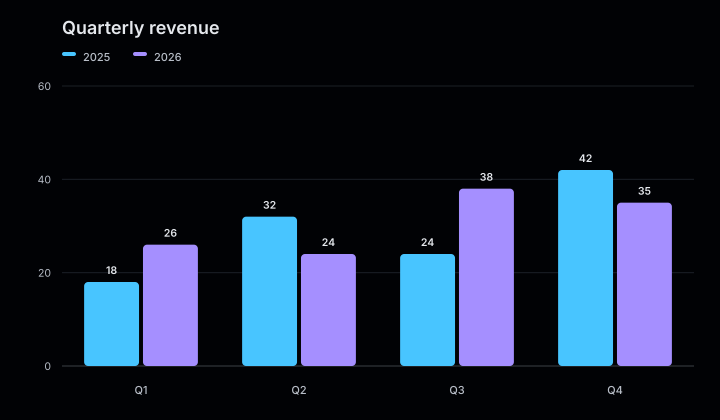

# Themes

A theme maps visual roles to colors and typography. It changes the appearance of a
chart without changing its model, scale, positions, or semantic SVG attributes.

<figure class="product-output product-output--chart">

<figcaption>The default theme resolves the background, text, grid, axes, and series palette.</figcaption>
</figure>

## Apply a theme

`Chart::render()` and `Chart::renderDocument()` accept an optional `Theme`. Without an argument, both
methods use `Theme::default()`.

```php
use Atelier\Chart\Chart;
use Atelier\Chart\Theme\Theme;

$model = Chart::bar()
    ->series('2025', ['Q1' => 18, 'Q2' => 32])
    ->series('2026', ['Q1' => 26, 'Q2' => 24])
    ->build();

echo Chart::render($model, Theme::warm());
```

Themes are immutable. Reuse one instance across any number of charts when they should
share the same visual system.

## Visual roles

Every theme defines:

- a background color;
- primary and muted text colors;
- grid and axis colors;
- a non-empty series palette;
- a font-family stack.

The renderer writes these roles into SVG attributes. Presets use explicit colors.
Custom theme values such as `currentColor` or CSS variables are resolved by the browser
and can therefore depend on the surrounding page when the SVG is embedded inline.

## Color priority

An explicit series, slice, gauge, or sparkline color overrides the corresponding
palette entry. The rest of the chart still uses the active theme.

```php
$model = Chart::line()
    ->series('Revenue', ['Jan' => 18, 'Feb' => 27], '#2563eb')
    ->build();
```

When a chart has more series than palette colors, the renderer cycles through the
palette in order.

See [Presets](presets.md) for the included themes or [Custom themes](custom-themes.md)
to define your own visual roles.
