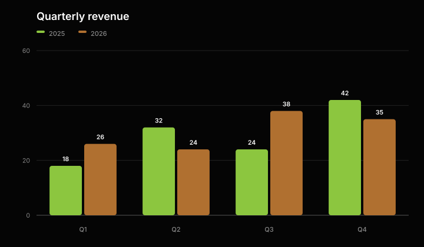
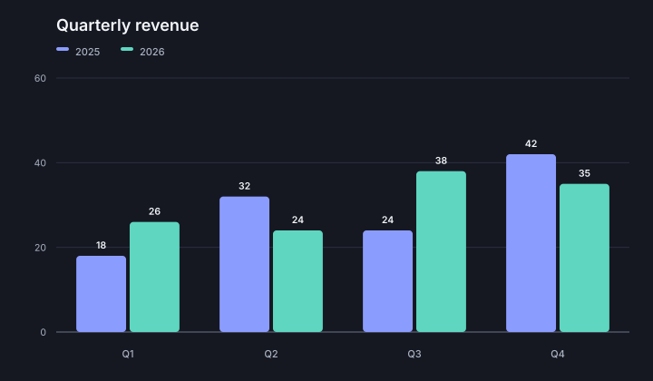
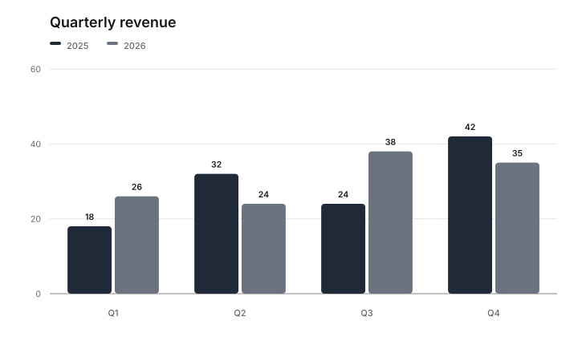
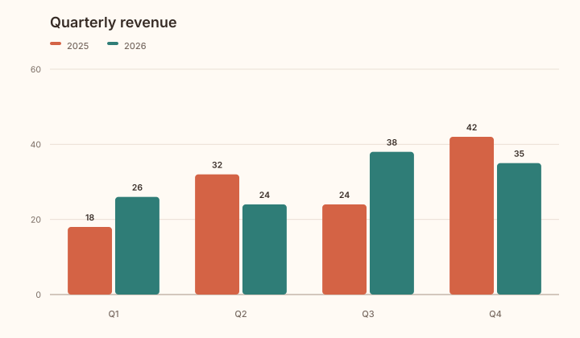

# Presets

Atelier Chart includes five immutable theme presets. Each preset defines the complete
set of visual roles required by the renderer.

<div class="figure-grid">
<figure class="product-output product-output--chart">

<figcaption>Default</figcaption>
</figure>
<figure class="product-output product-output--chart">

<figcaption>Alto</figcaption>
</figure>
<figure class="product-output product-output--chart">

<figcaption>Dark</figcaption>
</figure>
<figure class="product-output product-output--chart">

<figcaption>Mono</figcaption>
</figure>
<figure class="product-output product-output--chart">

<figcaption>Warm</figcaption>
</figure>
</div>

## Available presets

| Preset | Intended surface |
| --- | --- |
| `Theme::default()` | Near-black Atelier canvas with a cyan-led palette |
| `Theme::alto()` | Black canvas with the original Alto accent scale |
| `Theme::dark()` | Soft dark canvas with lighter text and muted accents |
| `Theme::mono()` | White canvas with a grayscale palette |
| `Theme::warm()` | Warm light canvas with earthy accents |

Select the preset when rendering, not when building the model.

```php
$svg = Chart::render($model, Theme::mono());
```

This separation lets one immutable chart model produce several presentation variants.
The selected preset is resolved directly into SVG attributes, so the output does not
depend on page-level styles.
